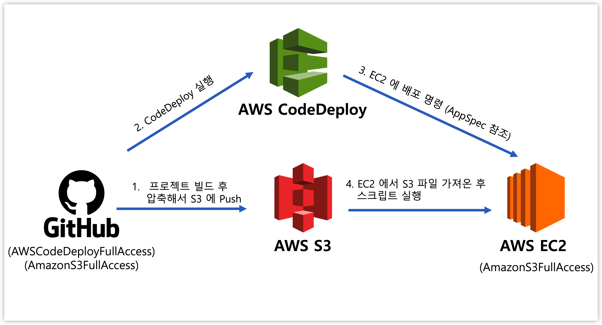
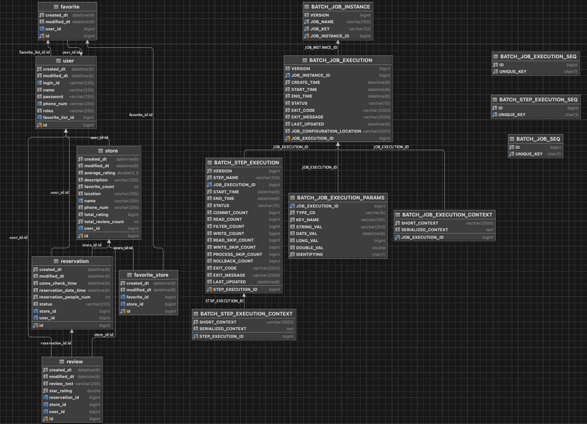

# 🗒 상점 예약 서비스

등록된 매장에 한해서 실시간 검색 순위를 볼 수 있으며, 예약시간 10분전 SMS 문자알림이 가는 식당 예약 API 입니다.

## 프로젝트 기능 및 설계

### [ All ]

- 회원가입 기능
    - 사용자는 회원가입을 할 수 있다. 일반적으로 모든 사용자는 회원가입시 USER 권한 (일반 권한)을 지닌다.
    - 회원가입시 아이디와 패스워드를 입력받으며, 아이디는 unique 해야한다.

- 로그인 기능
    - 사용자는 로그인을 할 수 있다. 로그인시 회원가입때 사용한 아이디와 패스워드가 일치해야한다.
    - 로그인시 Access Token 으로 jwt 토큰이 발급된다.

- 식당 목록 조회 기능
    - 모든 식당의 목록을 조회할 수 있으며, 검색을 통해 식당의 상세 정보를 확인할 수 있다.
    - 모든 식당에 대한 리뷰도 조회할 수 있다.

- 실시간 검색 순위 확인 기능
    - 모든 식당에 대해 사용자들이 얼마나 자주 검색하였는지 실시간 검색상점 순위를 확인할 수 있다.

### [ ADMIN ]

- 매장 관리 기능
    - ADMIN 권한을 부여받은 사용자는 자신의 매장을 서비스에 등록, 수정, 삭제 기능을 부여받는다.
    - 자신이 등록한 매장에 관한 예약 내역을 확인하고 예약 승인, 거절이 가능하다.

### [ USER ]

- 권한 요청 기능
    - 모든 사용자는 요청을 통해 ADMIN 권한 (상점 주인 권한)을 지닐 수 있다.

- 예약 기능
    - 로그인한 사용자는 자신이 원하는 시간에 식당에 대한 예약을 할 수 있다.
    - 예약을 한 사용자는 자신이 예약한 상점에 대한 예약을 취소할 수 있다.

- 리뷰 기능
    - 예약을 한 사용자는 자신이 예약하여 상점을 이용하고 난 뒤 상점에 대한 리뷰를 작성할 수 있다.
    - 리뷰를 작성한 사용자는 자신이 작성한 리뷰에 대해 수정, 삭제를 할 수 있다.

- 자주가는 식당 추가 기능
    - 자신이 자주가는 식당을 등록하여 특정 요청시 그 상점에 대한 정보만 확인할 수 있다.

### [ Goal of this project ]

- AWS 웹 호스팅, CI/CD
  - 

- Elasticsearch 를 통한 실시간 검색 순위 구현

- 예약 승인, 예약 거절, 예약시간 10분 전 세 가지 경우에 SENS(Simple & Easy Notification Service)를 통해 SMS 전송

## ERD

## Trouble Shooting

[go to the trouble shooting section](doc/TROUBLE_SHOOTING.md)

### Tech Stack

 
  
  
  
  
  

[//]: # (   )
[//]: # (  )

